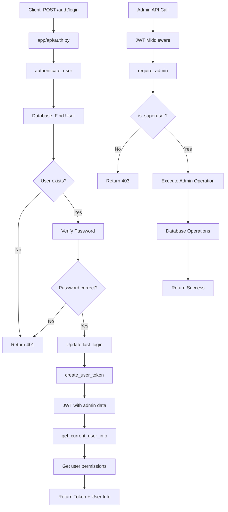

# Luồng hoạt động khi Admin đăng nhập vào hệ thống CameraAI

## 🔐 **LUỒNG ĐĂNG NHẬP ADMIN**

### **Bước 1: Client gửi request đăng nhập**
```http
POST /auth/login
{
    "username": "admin",
    "password": "admin_password"
}
```

### **Bước 2: Xử lý tại API Layer**
**File: `app/api/auth.py`**
```python
@router.post("/login", response_model=Token)
async def login(user_in: UserLogin):
    # Gọi auth_service để xác thực
    user = await authenticate_user(user_in.username, user_in.password)
```

### **Bước 3: Authentication Service**
**File: `app/services/auth_service.py`**
```python
async def authenticate_user(username: str, password: str):
    # 1. Tìm user trong database
    users = get_collection("users")
    user = await users.find_one({"username": username})
    
    # 2. Kiểm tra password
    if not user or not verify_password(password, user["hashed_password"]):
        return None
    
    # 3. Cập nhật last_login
    await users.update_one(
        {"_id": user["_id"]},
        {"$set": {"last_login": datetime.utcnow()}}
    )
    
    return user  # Trả về user object với is_superuser: true
```

### **Bước 4: Tạo JWT Token**
**File: `app/services/auth_service.py`**
```python
def create_user_token(user):
    return create_access_token(data={
        "sub": user["username"],           # "admin"
        "user_id": str(user["_id"]),       # User ID
        "roles": user.get("roles", []),    # ["admin"]
        "permissions": user.get("permissions", [])  # ["*"] hoặc tất cả permissions
    })
```

### **Bước 5: Lấy thông tin user đầy đủ**
**File: `app/services/auth_service.py`**
```python
async def get_current_user_info(user_id: str) -> Optional[UserOut]:
    # 1. Lấy user từ database
    user = await users.find_one({"_id": ObjectId(user_id)})
    
    # 2. Lấy permissions từ role_service
    permissions = await get_user_permissions(user_id)
    
    # 3. Trả về UserOut object
    return UserOut(
        id=str(user["_id"]),
        username=user["username"],
        is_active=user.get("is_active", True),
        is_superuser=user.get("is_superuser", False),  # TRUE cho admin
        roles=user.get("roles", []),                    # ["admin"]
        permissions=permissions,                        # Tất cả permissions
        created_at=user.get("created_at"),
        last_login=user.get("last_login")
    )
```

### **Bước 6: Response trả về**
```json
{
    "access_token": "eyJ0eXAiOiJKV1QiLCJhbGciOiJIUzI1NiJ9...",
    "token_type": "bearer",
    "user": {
        "id": "user_id",
        "username": "admin",
        "is_active": true,
        "is_superuser": true,
        "roles": ["admin"],
        "permissions": ["users:read", "users:write", "users:delete", "users:admin", ...],
        "created_at": "2024-01-01T00:00:00",
        "last_login": "2024-01-01T12:00:00"
    }
}
```

## 🔑 **QUYỀN HẠN ADMIN**

### **Admin có quyền gì?**

**File: `app/services/role_service.py`**
```python
DEFAULT_ROLES = [
    {
        "name": "admin",
        "description": "Full system administrator with all permissions",
        "permissions": ["*"],  # Wildcard - TẤT CẢ permissions
        "is_active": True
    }
]
```

**File: `app/core/permissions.py`**
```python
def require_superuser():
    """Require superuser privileges"""
    def check_superuser(current_user: UserOut = Depends(get_current_active_user)):
        if not current_user.is_superuser:
            raise HTTPException(status_code=403, detail="Superuser access required")
        return current_user
    return check_superuser
```

### **Các endpoint Admin có thể truy cập:**

1. **Permission Management** (`/permissions/*`)
   - Tạo, sửa, xóa permissions
   - Xem danh sách permissions
   - Khởi tạo default permissions

2. **User Management** (`/users/*`)
   - CRUD operations trên users
   - Assign/remove roles
   - Xem thông tin users

3. **Role Management** (`/auth/roles`, `/auth/permissions`)
   - Xem tất cả roles và permissions
   - Assign roles cho users

4. **System Administration**
   - Khởi tạo default data
   - System configuration

## 🛡️ **MIDDLEWARE KIỂM TRA ADMIN**

### **Khi Admin gọi API có yêu cầu admin:**

**File: `app/core/auth_middleware.py`**
```python
async def require_admin(current_user: dict = Depends(get_current_user)) -> dict:
    """Require admin privileges"""
    if not current_user.get("is_superuser", False):
        logger.warning(f"Admin access denied: User '{current_user['username']}' is not admin")
        raise HTTPException(
            status_code=status.HTTP_403_FORBIDDEN,
            detail="Admin access required"
        )
    return current_user
```

### **Luồng kiểm tra:**
1. **JWT Token Validation** → `get_current_user()`
2. **Database Lookup** → Tìm user trong MongoDB
3. **Admin Check** → Kiểm tra `is_superuser: true`
4. **Allow/Deny** → Cho phép hoặc từ chối

## 📊 **SƠ ĐỒ LUỒNG ADMIN LOGIN**



## 🔄 **CÁC FILE THAM GIA LUỒNG ADMIN**

### **Authentication Flow:**
1. **`app/api/auth.py`** - Login endpoint
2. **`app/services/auth_service.py`** - Authentication logic
3. **`app/core/security.py`** - Password verification
4. **`app/core/database.py`** - Database operations
5. **`app/services/role_service.py`** - Permission retrieval

### **Authorization Flow:**
1. **`app/core/auth_middleware.py`** - JWT validation
2. **`app/core/permissions.py`** - Permission checking
3. **`app/api/permissions.py`** - Admin-only endpoints
4. **`app/api/users.py`** - User management endpoints

### **Data Models:**
1. **`app/models/user.py`** - User database model
2. **`app/schemas/user.py`** - User response schemas
3. **`app/schemas/permission.py`** - Permission schemas

## ⚡ **ĐIỂM QUAN TRỌNG**

1. **Admin được xác định bởi**: `is_superuser: true` trong database
2. **Admin có quyền**: Wildcard permission `["*"]` = tất cả permissions
3. **JWT Token chứa**: username, user_id, roles, permissions
4. **Middleware kiểm tra**: `is_superuser` field cho admin operations
5. **Default roles**: Được khởi tạo tự động khi hệ thống start
6. **Logging**: Tất cả admin actions được log chi tiết
