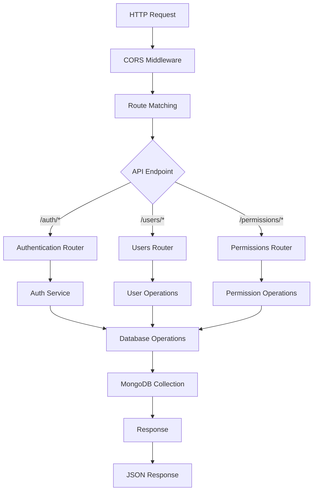
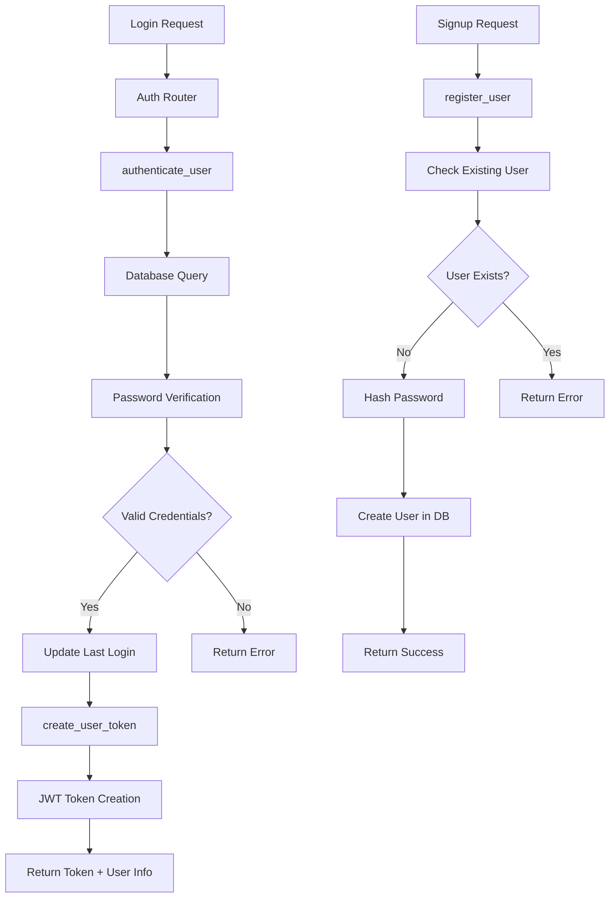
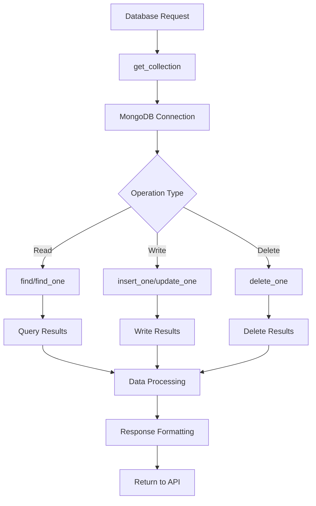
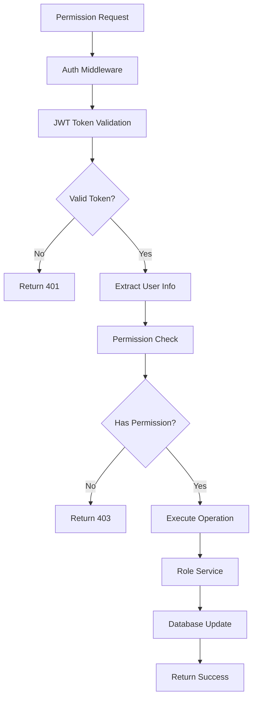
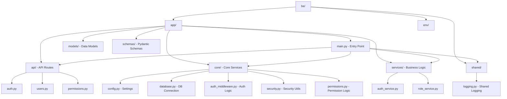

# Sơ đồ luồng hoạt động Backend CameraAI

## Luồng khởi động ứng dụng (main.py)

```mermaid
graph TD
    A[main.py - Khởi động ứng dụng] --> B[setup_logger - Thiết lập logging]
    B --> C[FastAPI App Creation]
    C --> D[CORS Middleware Setup]
    D --> E[Lifespan Events]
    
    E --> F[Startup: connect_to_mongo]
    F --> G[MongoDB Connection]
    G --> H[Database Ping Test]
    
    E --> I[API Routers Registration]
    I --> J[/auth - Authentication]
    I --> K[/users - User Management]
    I --> L[/permissions - Permission Management]
    
    E --> M[Uvicorn Server Start]
    M --> N[Server Running on Port 8000]
```

## Luồng xử lý request



## Luồng Authentication



## Luồng Database Operations



## Luồng Permission Management



## Cấu trúc thư mục và dependencies


