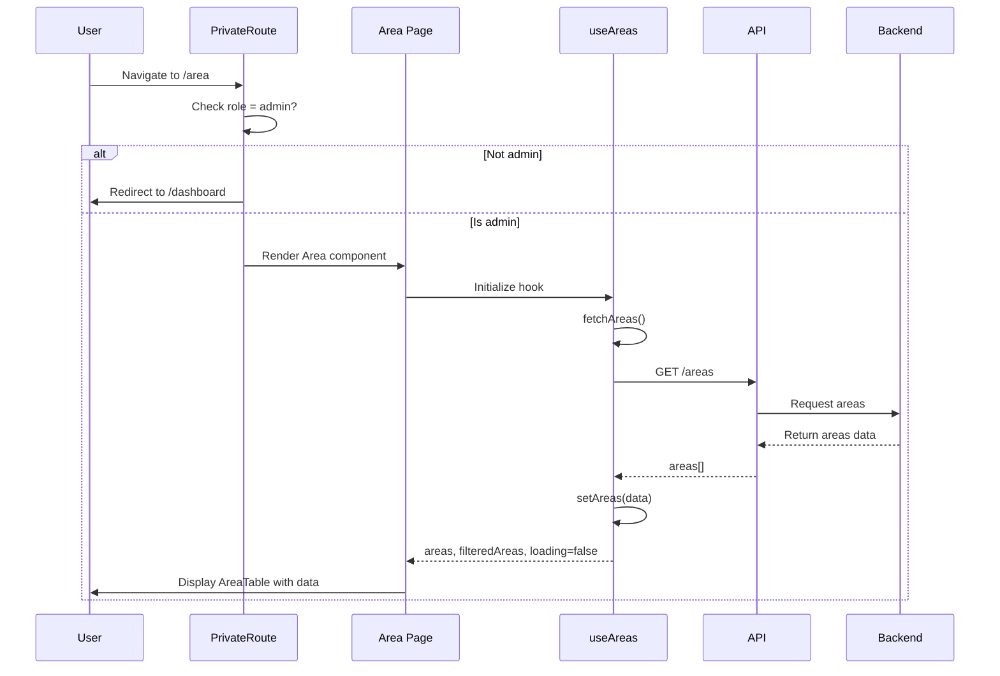
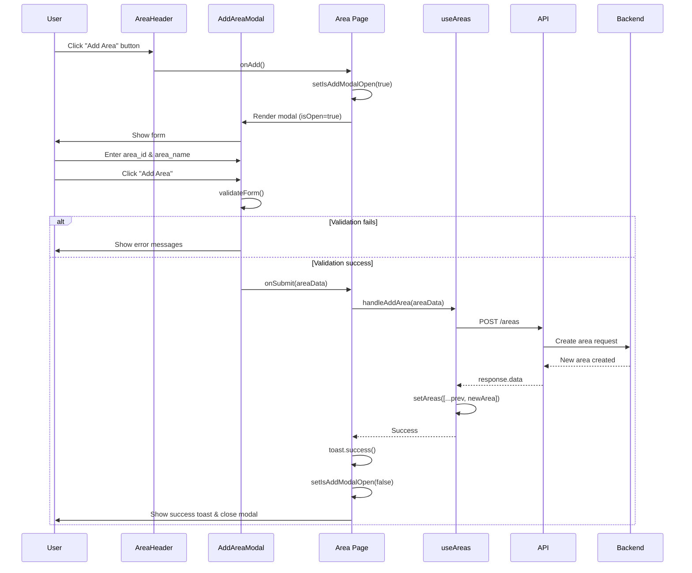
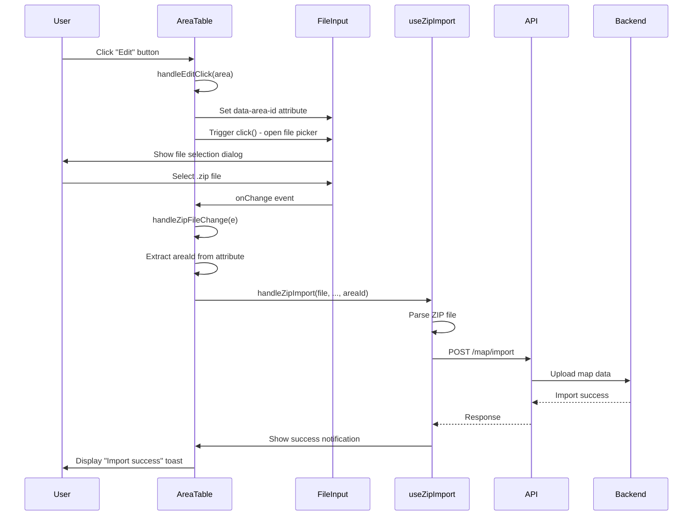
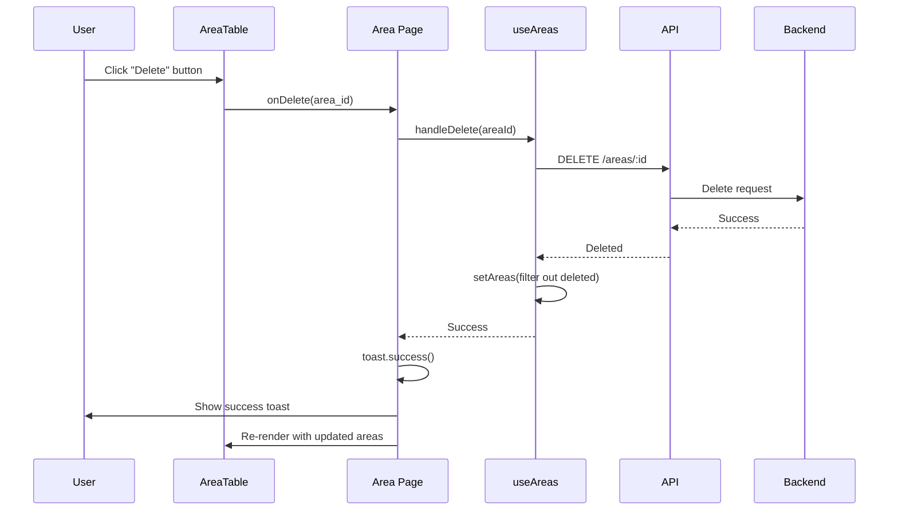
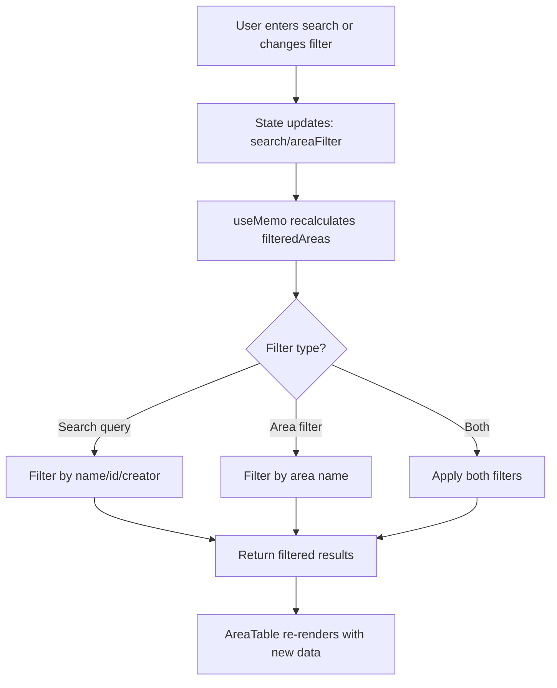

## Tổng Quan

Trang Area Management cho phép Admin quản lý các khu vực (area) trong hệ thống. 
Chức năng bao gồm 
- xem danh sách khu vực, 
- thêm khu vực mới, 
- chỉnh sửa bằng cách import bản đồ ZIP, 
- và xóa khu vực. 
Trang này chỉ dành cho user có role **admin**.

---

## 1. Các File Liên Quan

### 1.1. Pages

#### [Area.jsx](file:///d:/Honda/ai_project/fe/src/pages/Area.jsx)
- **Mục đích**: Component chính của trang quản lý khu vực
- **Chức năng**:
  - Render header, filters, và table
  - Quản lý modal thêm khu vực
  - Xử lý các actions: add, edit, delete
  - Hiển thị loading state và error handling
  - Toast notifications cho các thao tác

### 1.2. Components

#### [AreaHeader.jsx](file:///d:/Honda/ai_project/fe/src/components/Area/AreaHeader.jsx)
- **Mục đích**: Header với title và nút "Add Area"
- **Chức năng**:
  - Hiển thị tiêu đề "Area Management"
  - Nút "Add Area" để mở modal thêm khu vực mới
  - Đa ngôn ngữ với i18next

#### [AddAreaModal.jsx](file:///d:/Honda/ai_project/fe/src/components/Area/AddAreaModal.jsx)
- **Mục đích**: Modal dialog để thêm khu vực mới
- **Chức năng**:
  - Form với 2 fields: Area ID và Area Name
  - Validation:
    - Area ID: phải là số nguyên dương
    - Area Name: tối thiểu 2 ký tự
  - Real-time error display
  - Submit và Cancel buttons
  - Reset form sau khi thành công

#### [AreaFilters.jsx](file:///d:/Honda/ai_project/fe/src/components/Area/AreaFilters.jsx)
- **Mục đích**: Bộ lọc và tìm kiếm khu vực
- **Chức năng**:
  - Dropdown filter theo tên khu vực
  - Search input (hiện đang bị comment out)
  - Filter "All Areas" để hiển thị tất cả

#### [AreaTable.jsx](file:///d:/Honda/ai_project/fe/src/components/Area/AreaTable.jsx)
- **Mục đích**: Table hiển thị danh sách khu vực
- **Chức năng**:
  - Hiển thị thông tin: Area ID, Area Name, Created By, Created At
  - Nút Edit: Mở file picker để import ZIP file (bản đồ)
  - Nút Delete: Xóa khu vực
  - Pagination (20 items/page)
  - Integration với `useZipImport` hook
  - Status notifications cho import process

### 1.3. Hooks

#### [useAreas.js](file:///d:/Honda/ai_project/fe/src/hooks/Area/useAreas.js)
- **Mục đích**: Custom hook quản lý state và logic cho areas
- **Functions**:
  - `fetchAreas()`: Fetch danh sách areas từ API
  - `handleAddArea(areaData)`: Thêm area mới
  - `handleUpdateArea(areaId, areaData)`: Cập nhật area
  - `handleDelete(areaId)`: Xóa area
  - `refetchAreas()`: Làm mới danh sách areas
- **State**:
  - `areas`: Danh sách tất cả areas
  - `filteredAreas`: Areas sau khi filter
  - `loading`: Trạng thái loading
  - `error`: Lỗi nếu có
  - `search`: Search query
  - `areaFilter`: Filter hiện tại

### 1.4. Services

#### [area.js](file:///d:/Honda/ai_project/fe/src/services/area.js)
- **Mục đích**: API service layer cho area operations
- **Functions**:
  - `getAllAreas()`: GET `/areas` - Lấy tất cả areas
  - `createArea(areaData)`: POST `/areas` - Tạo area mới
  - `updateArea(areaId, areaData)`: PUT `/areas/:id` - Cập nhật area
  - `deleteArea(areaId)`: DELETE `/areas/:id` - Xóa area

### 1.5. Context

#### [AreaContext.jsx](file:///d:/Honda/ai_project/fe/src/contexts/AreaContext.jsx)
- **Mục đích**: Global context cho area selection (khác với area management)
- **Chức năng**:
  - Quản lý area hiện tại được chọn (`currAreaId`, `currAreaName`)
  - Fetch và cache danh sách areas
  - Role-based logic:
    - **Admin**: Có thể chọn bất kỳ area nào, lưu vào localStorage theo username
    - **Operator**: Chỉ có thể xem area được gán (`auth.user.area`)
  - `refetchAreas()`: Function để refresh data
  - Tự động reset khi user logout/login

### 1.6. Routing

#### [App.jsx](file:///d:/Honda/ai_project/fe/src/App.jsx)
- Route: `/area`
- Protected với `PrivateRoute` và `requiredRole={["admin"]}`
- Chỉ admin mới truy cập được

---

## 2. Kiến Thức Cần Biết

### 2.1. React Hooks

**useState**: Quản lý local state
```javascript
const [isAddModalOpen, setIsAddModalOpen] = useState(false);
const [formData, setFormData] = useState({ area_id: "", area_name: "" });
```

**useEffect**: Side effects, data fetching
```javascript
useEffect(() => {
  fetchAreas();
}, []); // Chạy khi component mount
```

**useMemo**: Memoize computed values
```javascript
const filteredAreas = useMemo(() => {
  // Filter logic chỉ chạy lại khi dependencies thay đổi
  return areas.filter(...);
}, [areas, search, areaFilter]);
```

**useRef**: Tham chiếu DOM elements
```javascript
const zipFileInputRef = useRef(null);
zipFileInputRef.current.click(); // Trigger file picker
```

### 2.2. Form Validation

Validation rules trong `AddAreaModal`:
1. **Area ID**:
   - Required (không được để trống)
   - Phải là số
   - Phải là số nguyên dương (> 0)

2. **Area Name**:
   - Required (không được để trống)
   - Tối thiểu 2 ký tự
   - Trim whitespace

### 2.3. React Context API

**Context Pattern**: Global state management
```javascript
// 1. Tạo Context
const AreaContext = createContext();

// 2. Provider Component
export const AreaProvider = ({ children }) => {
  const [state, setState] = useState();
  return (
    <AreaContext.Provider value={{ state }}>
      {children}
    </AreaContext.Provider>
  );
};

// 3. Custom Hook để consume context
export const useArea = () => {
  const context = useContext(AreaContext);
  return context;
};
```

### 2.4. Toast Notifications

Sử dụng `sonner` library:
```javascript
import { toast } from "sonner";

toast.success("Thành công!");
toast.error("Có lỗi xảy ra!");
```

### 2.5. File Upload

**Hidden Input Pattern**:
```javascript
<input
  ref={zipFileInputRef}
  type="file"
  accept=".zip"
  style={{ display: 'none' }}
  onChange={handleFileChange}
/>

// Trigger bằng ref
zipFileInputRef.current.click();
```

### 2.6. Internationalization (i18n)

Đa ngôn ngữ với `react-i18next`:
```javascript
const { t } = useTranslation();
<h1>{t('area.areaManagement')}</h1>
```

---

## 3. Luồng Hoạt Động Xử Lý

### 3.1. Luồng Load Trang Area



**Chi tiết các bước**:

1. **Route Protection**:
   - User navigate đến `/area`
   - `PrivateRoute` kiểm tra `requiredRole={["admin"]}`
   - Nếu không phải admin → Redirect về `/dashboard`
   - Nếu là admin → Render `Area` component

2. **Component Initialization**:
   ```javascript
   export default function AreaDashboard() {
     const [isAddModalOpen, setIsAddModalOpen] = useState(false);
     const { areas, filteredAreas, loading, ... } = useAreas();
     
     if (loading) {
       return <TrophySpin />; // Loading indicator
     }
     
     return (
       <div>
         <AreaHeader />
         <AreaFilters />
         <AreaTable areas={filteredAreas} />
         <AddAreaModal />
       </div>
     );
   }
   ```

3. **Data Fetching** (trong `useAreas`):
   ```javascript
   useEffect(() => {
     fetchAreas();
   }, []);
   
   const fetchAreas = async () => {
     try {
       setLoading(true);
       const areasData = await getAllAreas(); // GET /areas
       setAreas(areasData);
     } catch (error) {
       setError(error.message);
     } finally {
       setLoading(false);
     }
   };
   ```

4. **Display Data**:
   - `filteredAreas` được tính toán bởi `useMemo`
   - `AreaTable` render rows với pagination
   - Hiển thị: Area ID, Area Name, Created By, Created At

---

### 3.2. Luồng Thêm Khu Vực (Add Area)



**Chi tiết code flow**:

1. **Open Modal**:
   ```javascript
   // AreaHeader.jsx
   <Button onClick={onAdd}>Add Area</Button>
   
   // Area.jsx
   <AreaHeader onAdd={() => setIsAddModalOpen(true)} />
   ```

2. **Form Input & Validation**:
   ```javascript
   // AddAreaModal.jsx
   const validateForm = () => {
     const newErrors = {};
     
     if (!formData.area_id.trim()) {
       newErrors.area_id = "Area ID is required";
     } else if (isNaN(formData.area_id) || parseInt(formData.area_id) <= 0) {
       newErrors.area_id = "Area ID must be a positive number";
     }
     
     if (!formData.area_name.trim()) {
       newErrors.area_name = "Area Name is required";
     } else if (formData.area_name.trim().length < 2) {
       newErrors.area_name = "Area Name must be at least 2 characters";
     }
     
     setErrors(newErrors);
     return Object.keys(newErrors).length === 0;
   };
   ```

3. **Submit Form**:
   ```javascript
   // AddAreaModal.jsx
   const handleSubmit = async (e) => {
     e.preventDefault();
     
     if (!validateForm()) return;
     
     await onSubmit({
       area_id: parseInt(formData.area_id),
       area_name: formData.area_name.trim(),
     });
     
     // Reset form
     setFormData({ area_id: "", area_name: "" });
     setErrors({});
   };
   ```

4. **API Call**:
   ```javascript
   // useAreas.js
   const handleAddArea = async (areaData) => {
     const response = await api.post('/areas', areaData);
     const newArea = response.data;
     setAreas(prev => [...prev, newArea]);
   };
   ```

5. **Success Handling**:
   ```javascript
   // Area.jsx
   const handleAddAreaSubmit = async (areaData) => {
     try {
       await handleAddArea(areaData);
       toast.success("Thêm khu vực thành công");
       setIsAddModalOpen(false);
     } catch (error) {
       toast.error("Thêm khu vực thất bại");
     }
   };
   ```

---

### 3.3. Luồng Chỉnh Sửa Khu Vực (Edit Area - Import Map)



**Chi tiết implementation**:

1. **Hidden File Input Setup**:
   ```javascript
   // AreaTable.jsx
   const zipFileInputRef = useRef(null);
   
   return (
     <>
       <Button onClick={() => handleEditClick(area)}>Edit</Button>
       
       <input
         ref={zipFileInputRef}
         type="file"
         accept=".zip"
         style={{ display: 'none' }}
         onChange={handleZipFileChange}
       />
     </>
   );
   ```

2. **Edit Click Handler**:
   ```javascript
   const handleEditClick = (area) => {
     // Lưu area_id vào data attribute
     if (zipFileInputRef.current) {
       zipFileInputRef.current.setAttribute('data-area-id', area.area_id);
       // Mở file picker
       zipFileInputRef.current.click();
     }
   };
   ```

3. **File Change Handler**:
   ```javascript
   const handleZipFileChange = (e) => {
     const file = e.target.files[0];
     const areaId = e.target.getAttribute('data-area-id');
     
     if (file && areaId) {
       // Dummy setters để tránh lỗi
       const dummySetMapData = (data) => {
         localStorage.setItem('importedMapData', JSON.stringify(data));
       };
       
       // Gọi handleZipImport với area_id cụ thể
       handleZipImport(
         file,
         dummySetMapData,
         dummySetSecurityConfig,
         dummySetSelectedAvoidanceMode,
         parseInt(areaId)
       );
       
       alert(`Đang import bản đồ cho Area ${areaId}...`);
     }
     
     // Reset input để có thể chọn cùng file lần nữa
     e.target.value = '';
   };
   ```

4. **Status Notifications**:
   ```javascript
   {zipLoading && (
     <div className="loading-notification">
       Đang tải file ZIP...
     </div>
   )}
   
   {zipFileName && (
     <div className="success-notification">
       ✅ Import thành công: {zipFileName}
     </div>
   )}
   
   {zipError && (
     <div className="error-notification">
       ❌ {zipError}
     </div>
   )}
   ```

---

### 3.4. Luồng Xóa Khu Vực (Delete Area)



**Chi tiết code**:

1. **Delete Button**:
   ```javascript
   // AreaTable.jsx
   <Button
     variant="destructive"
     onClick={() => onDelete(area.area_id)}
   >
     Delete
   </Button>
   ```

2. **Delete Handler trong Area Page**:
   ```javascript
   // Area.jsx
   const handleDeleteArea = async (areaId) => {
     try {
       await handleDelete(areaId);
       toast.success("Xóa khu vực thành công");
     } catch (error) {
       console.error("Lỗi khi xóa area:", error);
       toast.error("Xóa khu vực thất bại");
     }
   };
   ```

3. **API Call**:
   ```javascript
   // useAreas.js
   const handleDelete = async (areaId) => {
     await api.delete(`/areas/${areaId}`);
     
     // Remove from state
     setAreas(prev => prev.filter(area => area.area_id !== areaId));
   };
   ```

**Lưu ý**: Hiện tại chưa có confirmation dialog trước khi xóa. Nên thêm để tránh xóa nhầm.

---

### 3.5. Luồng Filter & Search



**Implementation với useMemo**:

```javascript
// useAreas.js
const filteredAreas = useMemo(() => {
  let filtered = areas;

  // Apply search filter
  if (search.trim()) {
    filtered = filtered.filter(area =>
      area.area_name.toLowerCase().includes(search.toLowerCase()) ||
      area.area_id.toString().includes(search) ||
      area.created_by.toLowerCase().includes(search.toLowerCase())
    );
  }

  // Apply area filter
  if (areaFilter !== 'all') {
    filtered = filtered.filter(area => area.area_name === areaFilter);
  }

  return filtered;
}, [areas, search, areaFilter]);
```

**Tại sao dùng useMemo?**
- Tránh re-calculate filter mỗi lần component re-render
- Chỉ tính lại khi `areas`, `search`, hoặc `areaFilter` thay đổi
- Performance optimization cho danh sách lớn

---

## 4. Data Flow & State Management

### 4.1. Component Hierarchy

```
Area.jsx (Page)
├── AreaHeader.jsx
│   └── Button (Add Area)
├── AreaFilters.jsx
│   ├── Select (Area Filter)
│   └── Input (Search - commented out)
├── AreaTable.jsx
│   ├── Table (Display areas)
│   ├── Button (Edit - per row)
│   ├── Button (Delete - per row)
│   └── input[type="file"] (Hidden)
└── AddAreaModal.jsx
    ├── Dialog
    ├── Form
    │   ├── Input (Area ID)
    │   └── Input (Area Name)
    └── Buttons (Submit, Cancel)
```

### 4.2. State Locations

**Local State** (trong Area.jsx):
- `isAddModalOpen`: Modal visibility

**Custom Hook State** (useAreas):
- `areas`: Tất cả areas từ API
- `filteredAreas`: Areas sau khi filter
- `loading`: Loading state
- `error`: Error state
- `search`: Search query
- `areaFilter`: Current filter value

**Global State** (AreaContext):
- `currAreaId`: Area hiện tại được chọn
- `currAreaName`: Tên area hiện tại
- `areaData`: Cache của areas data

### 4.3. Props Drilling

```javascript
// Area.jsx
<AreaTable
  areas={filteredAreas}
  onEdit={handleEditArea}
  onDelete={handleDeleteArea}
/>

// AreaTable.jsx
areas.map(area => (
  <Button onClick={() => onDelete(area.area_id)}>Delete</Button>
))
```

---

## 5. API Endpoints

### GET `/areas`
**Mục đích**: Lấy tất cả areas

**Response**:
```json
[
  {
    "area_id": 1,
    "area_name": "Warehouse A",
    "created_by": "admin",
    "created_at": "2024-01-15T10:30:00Z"
  },
  {
    "area_id": 2,
    "area_name": "Warehouse B",
    "created_by": "operator1",
    "created_at": "2024-02-20T14:45:00Z"
  }
]
```

### POST `/areas`
**Mục đích**: Tạo area mới

**Request Body**:
```json
{
  "area_id": 3,
  "area_name": "Warehouse C"
}
```

**Response**:
```json
{
  "area_id": 3,
  "area_name": "Warehouse C",
  "created_by": "admin",
  "created_at": "2024-03-01T09:00:00Z"
}
```

### PUT `/areas/:id`
**Mục đích**: Cập nhật area

**Request Body**:
```json
{
  "area_name": "Warehouse C Updated"
}
```

### DELETE `/areas/:id`
**Mục đích**: Xóa area

**Response**: 204 No Content

---

## 6. Error Handling

### 6.1. Validation Errors

**Frontend Validation** (trong modal):
```javascript
// Area ID validation
if (!formData.area_id.trim()) {
  errors.area_id = "Area ID is required";
} else if (isNaN(formData.area_id)) {
  errors.area_id = "Area ID must be a number";
} else if (parseInt(formData.area_id) <= 0) {
  errors.area_id = "Area ID must be positive";
}

// Area Name validation
if (!formData.area_name.trim()) {
  errors.area_name = "Area Name is required";
} else if (formData.area_name.length < 2) {
  errors.area_name = "Minimum 2 characters";
}
```

### 6.2. API Errors

**Try/Catch Pattern**:
```javascript
try {
  await handleAddArea(areaData);
  toast.success("Success");
} catch (error) {
  console.error("Error:", error);
  toast.error(error?.message || "Failed");
}
```

**Service Layer Error Handling**:
```javascript
// area.js
export const getAllAreas = async () => {
  try {
    const response = await api.get('/areas');
    return response.data;
  } catch (error) {
    console.error('[AreaService] Error:', error);
    throw new Error(error.message || 'Failed to fetch areas');
  }
};
```

---

## 7. Best Practices & Patterns

### 7.1. Custom Hooks

Tách logic ra khỏi component:
```javascript
// ✅ Good - Logic trong hook
const { areas, handleAddArea, loading } = useAreas();

// ❌ Bad - Logic trực tiếp trong component
const [areas, setAreas] = useState([]);
const fetchAreas = async () => { /* ... */ };
useEffect(() => { fetchAreas() }, []);
```

### 7.2. Optimistic Updates vs Server Updates

**Current**: Server updates (đợi API response)
```javascript
await api.post('/areas', areaData);
const newArea = response.data;
setAreas(prev => [...prev, newArea]);
```

**Alternative**: Optimistic updates (update UI trước)
```javascript
const tempId = Date.now();
setAreas(prev => [...prev, { ...areaData, area_id: tempId }]);
try {
  const response = await api.post('/areas', areaData);
  setAreas(prev => prev.map(a => 
    a.area_id === tempId ? response.data : a
  ));
} catch (error) {
  setAreas(prev => prev.filter(a => a.area_id !== tempId));
}
```

### 7.3. Form Reset

Reset form sau khi submit thành công:
```javascript
const handleSubmit = async (e) => {
  await onSubmit(formData);
  
  // Reset form
  setFormData({ area_id: "", area_name: "" });
  setErrors({});
};
```

---

## 8. Troubleshooting

### 8.1. Common Issues

**Issue**: Areas không hiển thị sau khi thêm mới
- **Nguyên nhân**: State không update
- **Giải pháp**: Check `handleAddArea` có update state đúng không

**Issue**: Filter không hoạt động
- **Nguyên nhân**: `useMemo` dependencies thiếu
- **Giải pháp**: Verify dependencies: `[areas, search, areaFilter]`

**Issue**: Không thể import ZIP file
- **Nguyên nhân**: `data-area-id` không được set
- **Giải pháp**: Check `handleEditClick` có set attribute đúng không

**Issue**: Toast không hiển thị
- **Nguyên nhân**: Thiếu `<Toaster />` component
- **Giải pháp**: Thêm vào root component

### 8.2. Debug Tips

1. **Check API calls**: Network tab trong DevTools
2. **Check state**: React DevTools > Components
3. **Check console**: Tất cả async functions đều có console.log
4. **Check localStorage**: Application tab > Local Storage

---

## 9. Dependencies

```json
{
  "react": "^18.x.x",
  "react-i18next": "^13.x.x",
  "sonner": "^1.x.x",
  "lucide-react": "^0.x.x",
  "react-loading-indicators": "^1.x.x"
}
```

---

## 10. Environment Variables

Backend API base URL:
```env
VITE_API_URL=http://192.168.1.202:8001
```

Endpoints used:
- `GET /areas`
- `POST /areas`
- `PUT /areas/:id`
- `DELETE /areas/:id`
