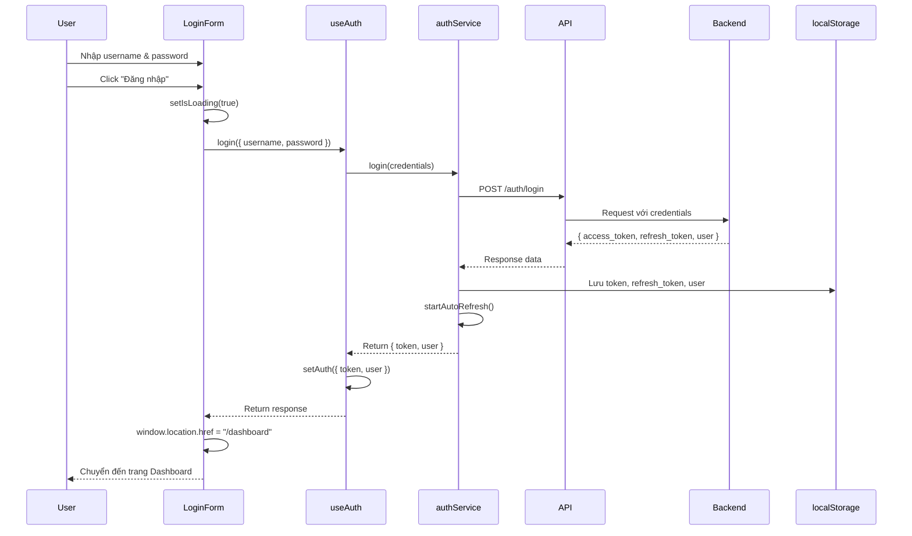
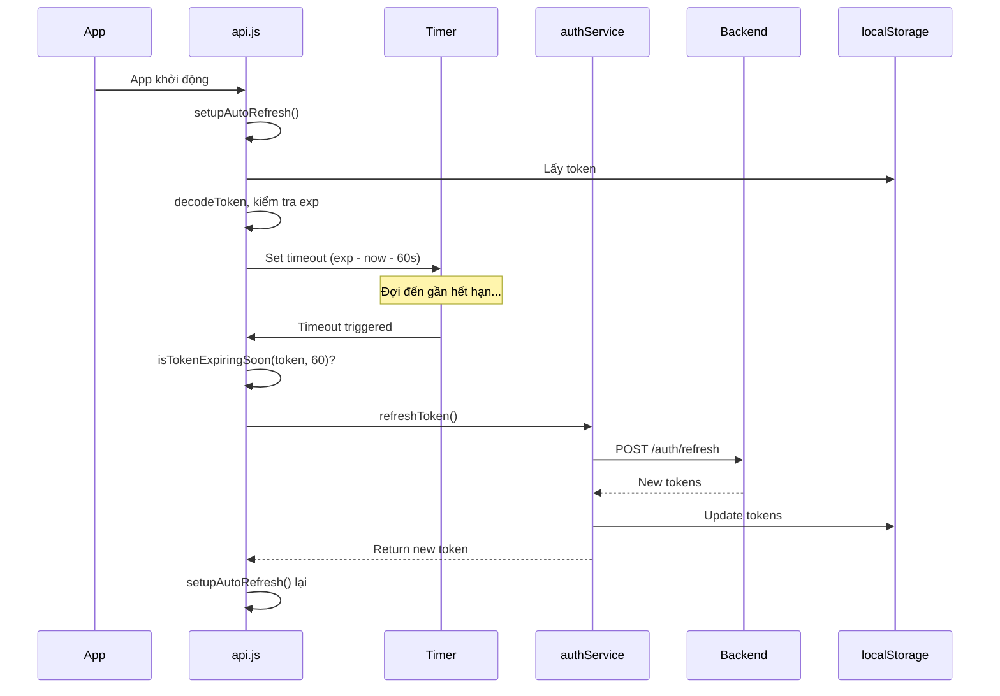
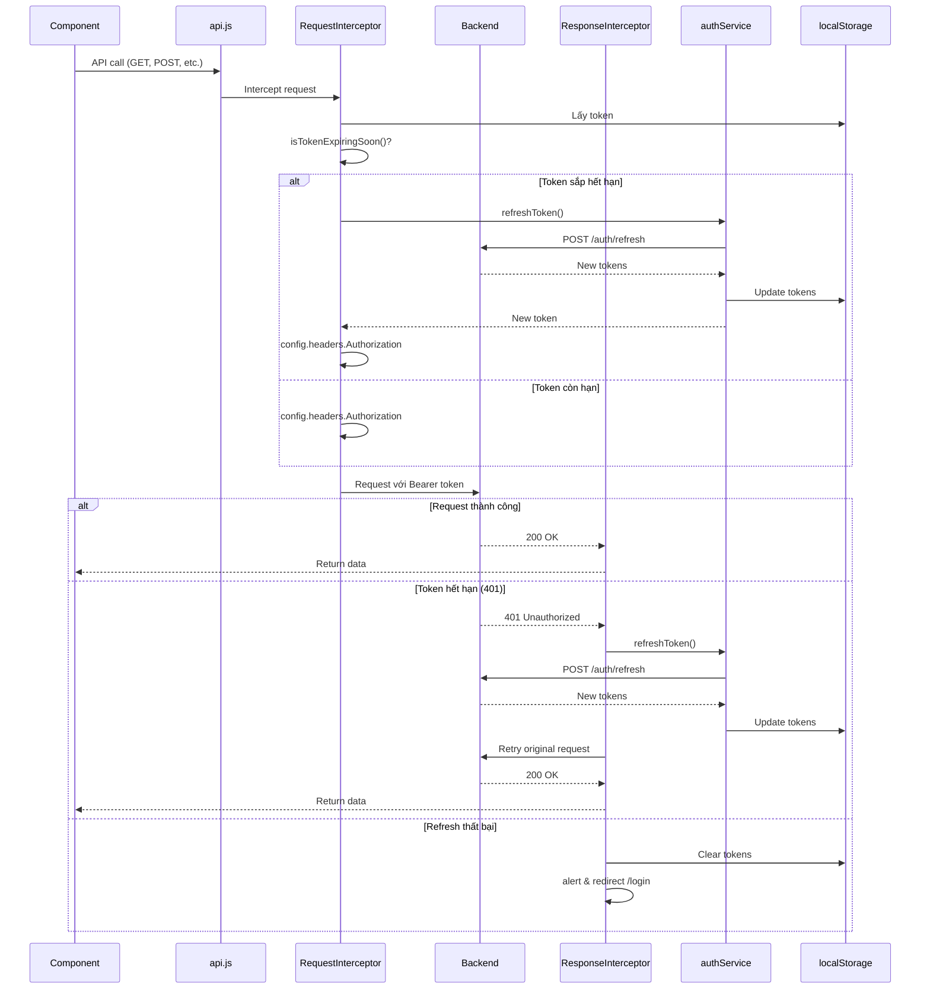
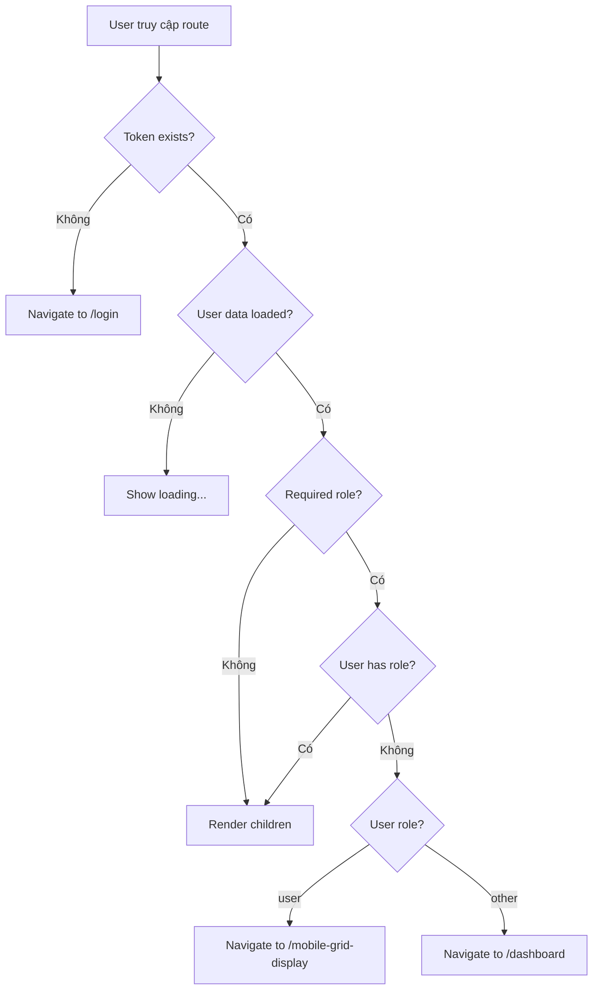
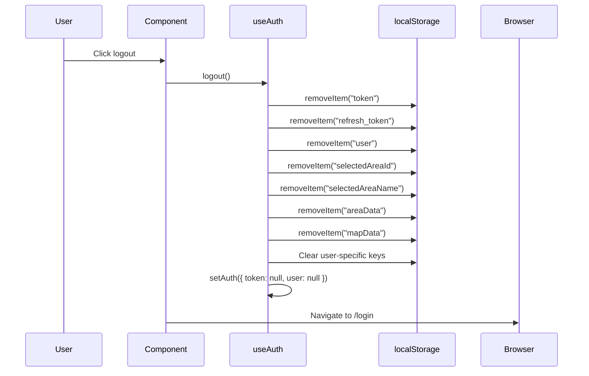

# Tài Liệu Chức Năng Đăng Nhập (Login)

## Tổng Quan

Hệ thống đăng nhập sử dụng JWT (JSON Web Token) authentication với cơ chế refresh token tự động để duy trì phiên làm việc của người dùng. Hệ thống hỗ trợ phân quyền theo vai trò (role-based authentication) và tự động chuyển hướng người dùng đến trang phù hợp sau khi đăng nhập.

---

## 1. Các File Liên Quan

### 1.1. Pages (Trang)

#### [Login.jsx](file:///d:/Honda/ai_project/fe/src/pages/Login.jsx)
- **Mục đích**: Trang đăng nhập chính của ứng dụng
- **Chức năng**: 
  - Hiển thị video nền với tốc độ phát chậm (0.3x)
  - Render form đăng nhập
  - UI/UX với hiệu ứng glassmorphism

### 1.2. Components (Thành Phần)

#### [login-form.jsx](file:///d:/Honda/ai_project/fe/src/components/Login-form/login-form.jsx)
- **Mục đích**: Form nhập thông tin đăng nhập
- **Chức năng**:
  - Quản lý state cho username và password
  - Xử lý submit form
  - Hiển thị thông báo lỗi
  - Loading state khi đang xử lý đăng nhập
  - Chuyển hướng đến `/dashboard` sau khi đăng nhập thành công

#### [PrivateRoute.jsx](file:///d:/Honda/ai_project/fe/src/components/PrivateRoute.jsx)
- **Mục đích**: Bảo vệ các route yêu cầu xác thực
- **Chức năng**:
  - Kiểm tra token trong localStorage
  - Kiểm tra thông tin user
  - Kiểm tra phân quyền theo role (admin, operator, user)
  - Chuyển hướng người dùng dựa trên role:
    - User thường: `/mobile-grid-display`
    - Admin/Operator: Cho phép truy cập các trang quản lý

### 1.3. Services (Dịch Vụ)

#### [auth.js](file:///d:/Honda/ai_project/fe/src/services/auth.js)
- **Mục đích**: Xử lý các API calls liên quan đến authentication
- **Functions chính**:
  - `login(credentials)`: Gửi request đăng nhập và lưu tokens
  - `refreshToken()`: Làm mới access token khi hết hạn
  - `logout()`: Xóa tokens khỏi localStorage

#### [api.js](file:///d:/Honda/ai_project/fe/src/services/api.js)
- **Mục đích**: Axios instance với interceptors xử lý authentication
- **Chức năng**:
  - Tự động thêm Bearer token vào header
  - Request interceptor: Kiểm tra và refresh token nếu sắp hết hạn
  - Response interceptor: Xử lý lỗi 401, tự động refresh và retry request
  - Auto-refresh mechanism: Tự động làm mới token trước 1 phút khi hết hạn
  - Quản lý failed request queue khi đang refresh token

### 1.4. Hooks

#### [useAuth.js](file:///d:/Honda/ai_project/fe/src/hooks/useAuth.js)
- **Mục đích**: Custom hook quản lý authentication state
- **Functions**:
  - `login(credentials)`: Wrapper cho login service, cập nhật auth state
  - `logout()`: Xóa tất cả dữ liệu liên quan đến user (bao gồm area data)
  - `auth`: State chứa token và user info

### 1.5. Utilities

#### [tokenUtils.js](file:///d:/Honda/ai_project/fe/src/utils/tokenUtils.js)
- **Mục đích**: Tiện ích xử lý JWT token
- **Functions**:
  - `decodeToken(token)`: Decode JWT token (không verify signature)
  - `getTokenExpiration(token)`: Lấy expiration time từ token
  - `isTokenExpiringSoon(token, seconds)`: Kiểm tra token sắp hết hạn
  - `isTokenExpired(token)`: Kiểm tra token đã hết hạn

### 1.6. Routing

#### [App.jsx](file:///d:/Honda/ai_project/fe/src/App.jsx)
- **Mục đích**: Cấu hình routing cho toàn bộ ứng dụng
- **Login routes**:
  - `/login`: Trang đăng nhập
  - `/`: Redirect về trang login
  - Protected routes được bọc trong `<PrivateRoute>` với role requirements

## 2. Kiến Thức Cần Biết

### 2.1. JWT Authentication Flow

**Cấu trúc JWT**: `header.payload.signature`

**Access Token vs Refresh Token**

### 2.2. Axios Interceptors

**Request Interceptor**:
```javascript
api.interceptors.request.use(async (config) => {
  // Modify request config trước khi gửi
  // Thêm Authorization header
  return config;
});
```

**Response Interceptor**:
```javascript
api.interceptors.response.use(
  (response) => response, // Success handler
  async (error) => {
    // Error handler - xử lý 401, retry logic
    return Promise.reject(error);
  }
);
```

### 2.3. LocalStorage

Dữ liệu được lưu trong browser's localStorage:
- `token`: Access token (JWT)
- `refresh_token`: Refresh token
- `user`: Thông tin user (JSON string)

**Lưu ý**: LocalStorage không mã hóa, nên không lưu thông tin nhạy cảm

### 2.5. React Hooks

- **useState**: Quản lý state trong functional components
- **useEffect**: Xử lý side effects (API calls, subscriptions)
- **Custom Hooks**: `useAuth` - logic tái sử dụng cho authentication

### 2.6. Protected Routes

Routes được bảo vệ bởi component `PrivateRoute`:
- Kiểm tra authentication trước khi render children
- Redirect về `/login` nếu chưa đăng nhập
- Kiểm tra permissions dựa trên `requiredRole`

---

## 3. Luồng Hoạt Động Xử Lý

### 3.1. Luồng Đăng Nhập (Login Flow)



**Chi tiết từng bước**:

1. **User nhập thông tin**: Username và password vào form
2. **Submit form**: 
   - Set `isLoading = true`
   - Set `error = null`
3. **LoginForm gọi useAuth.login()**:
   - Truyền `{ username, password }`
4. **useAuth gọi authService.login()**:
   - Gọi API endpoint `/auth/login`
5. **API Service xử lý**:
   - Gửi POST request đến backend
   - Nhận response: `{ access_token, refresh_token, token_type, user }`
6. **Lưu tokens vào localStorage**:
   - `localStorage.setItem("token", access_token)`
   - `localStorage.setItem("refresh_token", refresh_token)`
   - `localStorage.setItem("user", JSON.stringify(user))`
7. **Khởi động auto-refresh**:
   - `startAutoRefresh()` - thiết lập timer để tự động refresh token
8. **Cập nhật auth state**:
   - `setAuth({ token, user })`
9. **Redirect**:
   - `window.location.href = "/dashboard"`
   - Hard reload để đảm bảo tất cả contexts được khởi tạo lại
---

### 3.2. Luồng Auto-Refresh Token



**Chi tiết cơ chế Auto-Refresh**:

1. **Khởi động khi**:
   - App load lần đầu
   - Sau khi login thành công
   - Storage event (login từ tab khác)

2. **Setup timer**:
   ```javascript
   const exp = getTokenExpiration(token);
   const now = Math.floor(Date.now() / 1000);
   const timeUntilRefresh = exp - now - 60; // Refresh trước 1 phút
   
   setTimeout(() => {
     checkAndRefresh();
   }, timeUntilRefresh * 1000);
   ```

3. **Kiểm tra token sắp hết hạn**:
   - Nếu còn < 60 giây → Refresh ngay
   - Nếu còn nhiều thời gian → Set timer

4. **Refresh process**:
   - Gọi `POST /auth/refresh` với refresh_token
   - Nhận access_token và refresh_token mới
   - Lưu vào localStorage
   - Setup lại timer cho token mới

5. **Xử lý lỗi refresh**:
   - Nếu refresh thất bại → Logout tự động
   - Clear tất cả tokens
   - Alert user và redirect về `/login`

---

### 3.3. Luồng API Request với Token



**Chi tiết Request Interceptor**:

```javascript
api.interceptors.request.use(async (config) => {
  const token = localStorage.getItem("token");
  
  // 1. Kiểm tra token sắp hết hạn (trong 60s)
  if (token && isTokenExpiringSoon(token, 60) && !isRefreshing) {
    try {
      isRefreshing = true;
      const { token: newToken } = await refreshToken();
      config.headers.Authorization = `Bearer ${newToken}`;
      isRefreshing = false;
      return config;
    } catch (error) {
      isRefreshing = false;
    }
  }
  
  // 2. Thêm token vào header
  if (token) {
    config.headers.Authorization = `Bearer ${token}`;
  }
  
  return config;
});
```

**Chi tiết Response Interceptor**:

```javascript
api.interceptors.response.use(
  (response) => response,
  async (error) => {
    const originalRequest = error?.config;
    const status = error?.response?.status;
    
    // Kiểm tra 401 và chưa retry
    if (status === 401 && !originalRequest._retry) {
      // Nếu đang refresh, đợi trong queue
      if (isRefreshing) {
        return new Promise((resolve, reject) => {
          failedQueue.push({ resolve, reject });
        })
        .then((token) => {
          originalRequest.headers.Authorization = `Bearer ${token}`;
          return api(originalRequest);
        });
      }
      
      // Refresh token
      originalRequest._retry = true;
      isRefreshing = true;
      
      try {
        const { token: newToken } = await refreshToken();
        originalRequest.headers.Authorization = `Bearer ${newToken}`;
        
        // Xử lý queue
        processQueue(null, newToken);
        isRefreshing = false;
        
        // Retry request ban đầu
        return api(originalRequest);
      } catch (refreshError) {
        // Refresh thất bại → Logout
        processQueue(refreshError, null);
        isRefreshing = false;
        
        localStorage.clear();
        alert("Phiên đăng nhập đã hết hạn");
        window.location.replace("/login");
        
        return Promise.reject(refreshError);
      }
    }
    
    return Promise.reject(error);
  }
);
```

---

### 3.4. Luồng Protected Route & Authorization



**Chi tiết PrivateRoute**:

```javascript
function PrivateRoute({ children, requiredRole = null }) {
  const { auth } = useAuth();
  const token = localStorage.getItem("token");
  const user = auth?.user || null;

  // 1. Kiểm tra token
  if (!token) {
    return <Navigate to="/login" replace />;
  }

  // 2. Đợi load user data
  if (!user) {
    return <div>Đang tải thông tin user...</div>;
  }

  // 3. Kiểm tra required role
  if (requiredRole) {
    const requiredRoles = Array.isArray(requiredRole) 
      ? requiredRole 
      : [requiredRole];
    const hasPermission = user.roles?.some(role => 
      requiredRoles.includes(role)
    );

    if (!hasPermission) {
      // Redirect dựa trên role của user
      if (user.roles?.includes("user")) {
        return <Navigate to="/mobile-grid-display" replace />;
      } else {
        return <Navigate to="/dashboard" replace />;
      }
    }
  }

  // 4. Kiểm tra user thường chỉ được vào mobile-grid-display
  if (
    user.roles?.includes("user") &&
    !user.roles?.includes("admin") &&
    !user.roles?.includes("superuser")
  ) {
    if (window.location.pathname !== "/mobile-grid-display") {
      return <Navigate to="/mobile-grid-display" replace />;
    }
  }

  // 5. Render children nếu pass tất cả checks
  return children;
}
```

**Cấu hình routes trong App.jsx**:

```jsx
// Public routes
<Route path="/login" element={<LoginPage />} />
<Route path="/" element={<LoginPage />} />

// User role - Mobile Grid Display
<Route
  path="/mobile-grid-display"
  element={
    <PrivateRoute>
      <MobileGridDisplay />
    </PrivateRoute>
  }
/>

// Admin/Operator roles
<Route
  path="/dashboard"
  element={
    <PrivateRoute requiredRole={["admin", "operator"]}>
      <DashboardLayout>
        <Dashboard />
      </DashboardLayout>
    </PrivateRoute>
  }
/>

// Admin only
<Route
  path="/area"
  element={
    <PrivateRoute requiredRole={["admin"]}>
      <DashboardLayout>
        <Area />
      </DashboardLayout>
    </PrivateRoute>
  }
/>
```

---

### 3.5. Luồng Logout



**Chi tiết logout function**:

```javascript
const logout = () => {
  // 1. Xóa authentication tokens
  localStorage.removeItem("token");
  localStorage.removeItem("refresh_token");
  localStorage.removeItem("user");
  
  // 2. Xóa dữ liệu application-specific
  localStorage.removeItem("selectedAreaName");
  localStorage.removeItem("selectedAreaId");
  localStorage.removeItem("currAreaName");
  localStorage.removeItem("currAreaId");
  localStorage.removeItem("areaData");
  localStorage.removeItem("currentAreaId");
  localStorage.removeItem("mapData");
  localStorage.removeItem("importedMapData");
  
  // 3. Xóa user-specific localStorage items
  const keys = Object.keys(localStorage);
  keys.forEach(key => {
    if (key.startsWith('selectedAreaId_') || 
        key.startsWith('selectedAreaName_')) {
      localStorage.removeItem(key);
    }
  });
  
  // 4. Clear auth state
  setAuth({ token: null, user: null });
};
```

---

## 4. Các Tình Huống Xử Lý Đặc Biệt

### 4.1. Multiple Tabs/Windows

Khi user login từ nhiều tab:
- Storage event listener trong `api.js` phát hiện token mới
- Tự động setup auto-refresh cho tab đó
- Tất cả tabs chia sẻ cùng tokens

### 4.2. Token Expiry During Request

Khi token hết hạn giữa chừng request:
- Response interceptor bắt lỗi 401
- Tự động refresh token
- Retry request ban đầu với token mới
- User không nhận thấy gián đoạn

### 4.3. Concurrent Requests

Khi nhiều requests cùng lúc và token hết hạn:
- Request đầu tiên trigger refresh
- Các requests khác vào `failedQueue`
- Sau khi refresh xong, tất cả requests retry với token mới
- Tránh race condition với flag `isRefreshing`

### 4.4. Refresh Token Hết Hạn

Khi refresh token cũng hết hạn:
- Refresh request thất bại
- Clear tất cả tokens
- Alert user
- Force redirect về `/login`
- User phải đăng nhập lại

### 4.5. Network Errors

Xử lý lỗi mạng:
```javascript
try {
  await login(credentials);
} catch (error) {
  if (error.message) {
    setError(error.message);
  } else {
    setError("Lỗi kết nối. Vui lòng thử lại.");
  }
}
```

---

## 5. Best Practices & Security

### 5.1. Security Considerations

1. **HTTPS Only**: Luôn sử dụng HTTPS trong production
2. **Token Storage**: LocalStorage có rủi ro XSS, cân nhắc httpOnly cookies
3. **Token Expiry**: Access token nên có lifetime ngắn (15-30 phút)
4. **Refresh Token Rotation**: Backend nên rotate refresh token mỗi lần refresh
5. **Input Validation**: Validate input ở cả frontend và backend

### 5.2. Error Handling

1. **User-friendly messages**: Hiển thị thông báo lỗi dễ hiểu
2. **Logging**: Log errors để debug (console.error)
3. **Graceful degradation**: Xử lý lỗi không crash app
4. **Retry mechanism**: Tự động retry failed requests

### 5.3. Performance

1. **Minimize re-renders**: Sử dụng useState và useEffect hiệu quả
2. **Debounce API calls**: Tránh gọi API quá nhiều
3. **Lazy loading**: Load components khi cần thiết
4. **Token caching**: Cache token trong memory (state) và localStorage

---

## 6. Testing Scenarios

### 6.1. Manual Testing

1. **Login Success**:
   - Nhập username/password đúng → Redirect đến dashboard
   
2. **Login Failure**:
   - Nhập sai credentials → Hiển thị error message
   
3. **Token Refresh**:
   - Đợi token sắp hết hạn → Tự động refresh
   
4. **Logout**:
   - Click logout → Clear data và redirect về login
   
5. **Protected Routes**:
   - Truy cập route khi chưa login → Redirect về /login
   - Truy cập route không có permission → Redirect phù hợp

6. **Role-based Access**:
   - User role → Chỉ vào được /mobile-grid-display
   - Admin role → Vào được tất cả trang

### 6.2. Edge Cases

1. **Expired token trong localStorage khi khởi động app**
2. **Network timeout khi login**
3. **Backend down khi refresh token**
4. **Multiple rapid API calls khi token hết hạn**
5. **Login từ 2 tabs đồng thời**

---

## 7. Troubleshooting

### 7.1. Common Issues

**Issue**: "Phiên đăng nhập đã hết hạn" liên tục
- **Nguyên nhân**: Refresh token hết hạn hoặc invalid
- **Giải pháp**: Clear localStorage và login lại

**Issue**: Infinite redirect loop
- **Nguyên nhân**: Token exists nhưng invalid, không thể refresh
- **Giải pháp**: Check backend logs, verify token format

**Issue**: 401 errors không trigger refresh
- **Nguyên nhân**: Response interceptor không match điều kiện
- **Giải pháp**: Check `error.response.data.detail` format

**Issue**: Token không được thêm vào header
- **Nguyên nhân**: Request interceptor không execute
- **Giải pháp**: Check axios instance configuration

### 7.2. Debug Tips

1. **Check localStorage**: Xem tokens có tồn tại không
2. **Console logs**: Theo dõi auth flow trong console
3. **Network tab**: Xem request/response headers
4. **Decode JWT**: Dùng jwt.io để decode và check expiry
5. **Backend logs**: Verify token validation ở backend

---

## 8. Environment Variables

```env
VITE_API_URL=http://192.168.1.202:8001
```

Backend API base URL cho authentication endpoints:
- `POST /auth/login`
- `POST /auth/refresh`

---

## 9. Dependencies

```json
{
  "axios": "^1.x.x",
  "react": "^18.x.x",
  "react-router-dom": "^6.x.x"
}
```

---

