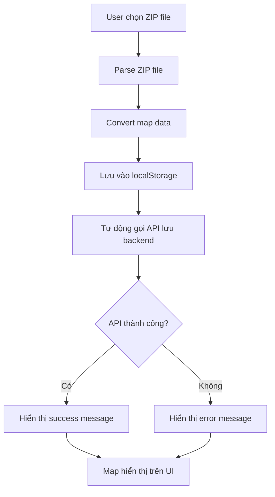

# Map Import với Auto-Save Backend

## Tổng quan
Đã thêm chức năng tự động lưu map data lên backend sau khi import ZIP file thành công.

## Các thay đổi chính

### 1. **MapService** (`fe/src/services/mapService.js`)
- ✅ Tạo service để gọi API lưu map lên backend
- ✅ Hỗ trợ `saveMapToBackend()`, `getMapFromBackend()`, `getAllAreas()`
- ✅ Error handling chi tiết cho các trường hợp khác nhau
- ✅ Logging để debug

### 2. **useZipImport Hook** (`fe/src/hooks/MapDashboard/useZipImport.jsx`)
- ✅ Thêm `saveToBackendLoading` và `saveToBackendError` states
- ✅ Thêm `saveMapToBackendAsync()` function
- ✅ Tự động gọi API lưu map sau khi import thành công
- ✅ Cập nhật `handleZipImport()` để nhận `areaId` parameter

### 3. **MapImport Component** (`fe/src/components/Overview/map/AMRWarehouseMap/MapImport.jsx`)
- ✅ Hiển thị loading state khi đang lưu lên backend
- ✅ Hiển thị error message nếu lưu backend thất bại
- ✅ UI feedback rõ ràng cho user

### 4. **AMRWarehouseMap Component** (`fe/src/components/Overview/map/AMRWarehouseMap/AMRWarehouseMap.jsx`)
- ✅ Truyền các props mới cho MapImport component

## Luồng hoạt động



## API Endpoints sử dụng

### Lưu Map
```
POST /areas/{area_id}/map
Content-Type: application/json
Authorization: Bearer {token}

Body: {
  "nodeKeys": [...],
  "lineKeys": [...],
  "nodeArr": [...],
  "lineArr": [...]
}
```

### Lấy Map
```
GET /areas/{area_id}/map
Authorization: Bearer {token}
```

## Error Handling

### Frontend Errors
- ❌ **Network Error**: "Không thể kết nối đến server"
- ❌ **401 Unauthorized**: "Bạn cần đăng nhập để lưu map"
- ❌ **403 Forbidden**: "Bạn không có quyền lưu map"
- ❌ **404 Not Found**: "Area với ID {area_id} không tồn tại"
- ❌ **500 Server Error**: "Lỗi server: {message}"

### Backend Errors
- ❌ **Collection không tồn tại**: MongoDB tự động tạo collection "maps"
- ❌ **Map đã tồn tại**: Tự động xóa map cũ và thêm map mới
- ❌ **Invalid data**: Validation error từ backend

## States và UI Feedback

### Loading States
1. **zipLoading**: "Đang tải..." (màu xanh)
2. **saveToBackendLoading**: "Đang lưu lên server..." (màu vàng)

### Success States
- **zipFileName**: "✓ {filename}" (màu xanh lá)

### Error States
- **zipError**: Error từ việc parse ZIP (màu đỏ)
- **saveToBackendError**: "⚠️ Lưu server: {error}" (màu đỏ)

## Cách sử dụng

### 1. Import Map
```javascript
// Component sẽ tự động gọi API sau khi import thành công
const { handleZipImport } = useZipImport();
handleZipImport(file, setMapData, setSecurityConfig, setSelectedAvoidanceMode, areaId);
```

### 2. Manual Save (nếu cần)
```javascript
import { saveMapToBackend } from '@/services/mapService';

const result = await saveMapToBackend(areaId, mapData);
if (result.success) {
  console.log('Map saved successfully');
}
```

## Configuration

### Environment Variables
```env
VITE_API_URL=http://192.168.1.6:8001
```

### Default Area ID
- Mặc định sử dụng `areaId = 1`
- Có thể truyền `areaId` khác khi gọi `handleZipImport()`

## Testing

### Test Cases
1. ✅ Import ZIP file thành công → Map hiển thị + Lưu backend thành công
2. ✅ Import ZIP file thành công → Map hiển thị + Lưu backend thất bại
3. ✅ Import ZIP file thất bại → Error message
4. ✅ Network error → Error message
5. ✅ Unauthorized → Error message

### Manual Testing
1. Mở browser DevTools → Network tab
2. Import ZIP file
3. Kiểm tra:
   - Request đến `POST /areas/1/map`
   - Response status và data
   - UI feedback messages

## Troubleshooting

### Common Issues
1. **"Không thể kết nối đến server"**
   - Kiểm tra `VITE_API_URL` trong `.env`
   - Kiểm tra backend server có chạy không

2. **"Bạn cần đăng nhập để lưu map"**
   - Kiểm tra token trong localStorage
   - Đăng nhập lại nếu cần

3. **"Area với ID 1 không tồn tại"**
   - Tạo area với ID 1 trước
   - Hoặc thay đổi areaId trong code

4. **Map không hiển thị sau khi import**
   - Kiểm tra console logs
   - Kiểm tra localStorage có data không
   - Refresh page để reload từ localStorage
