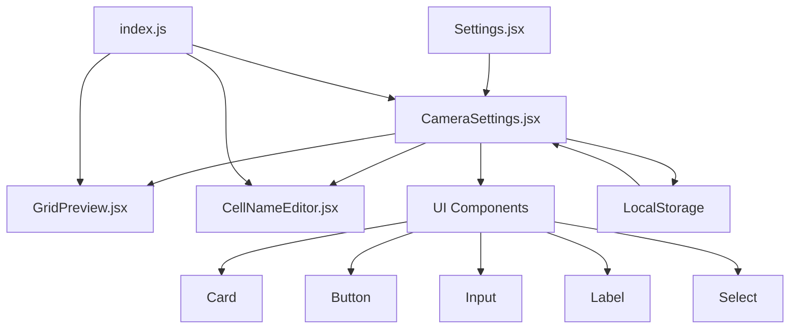
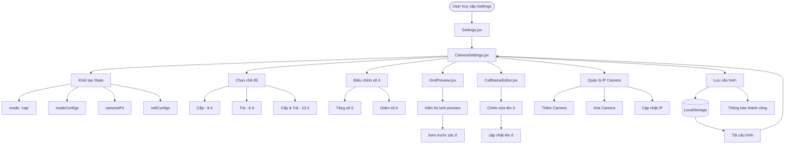
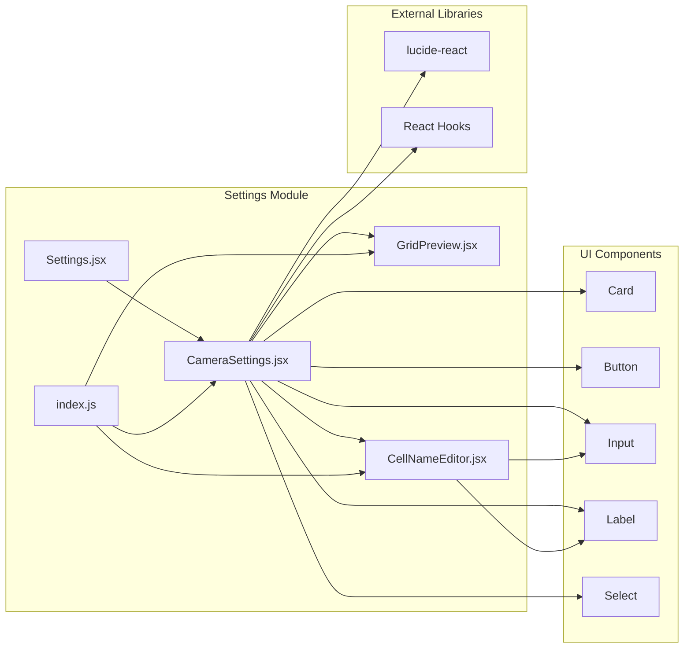
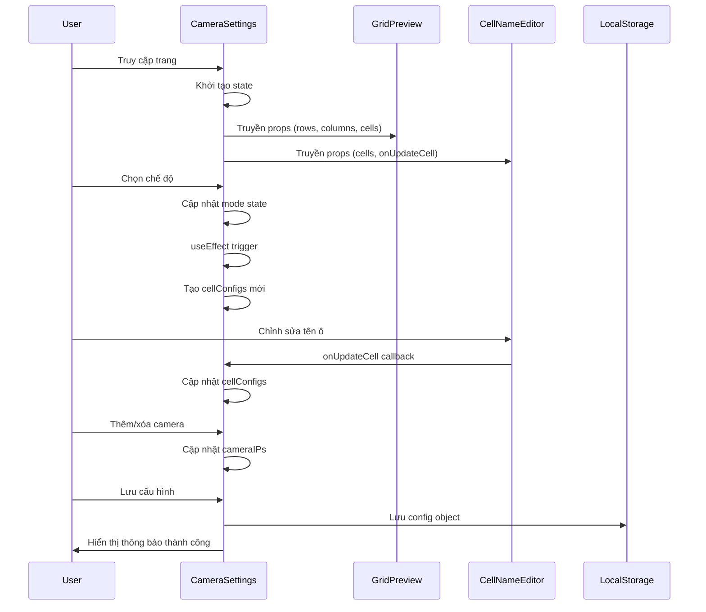
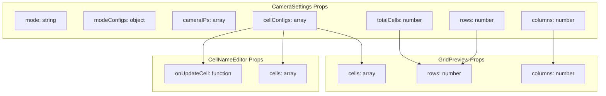
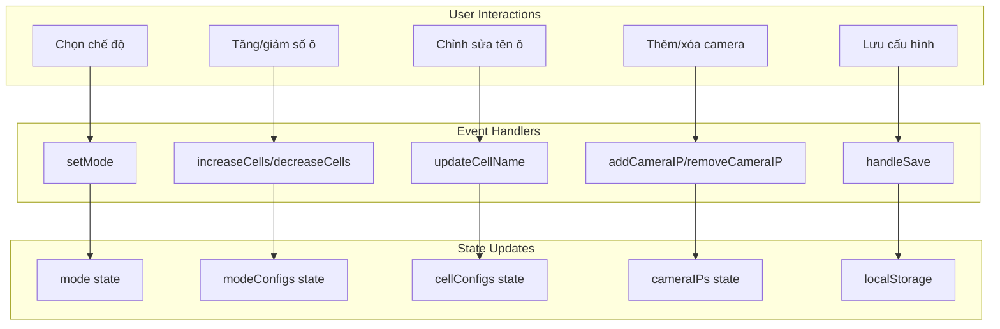

# Settings Components Flow Chart

## Tổng quan kiến trúc Settings



## Chi tiết luồng hoạt động



## Luồng dữ liệu State Management

```mermaid
stateDiagram-v2
    [*] --> InitialState
    
    InitialState --> ModeSelection
    ModeSelection --> ConfigUpdate
    ConfigUpdate --> CellGeneration
    CellGeneration --> CellEditing
    CellEditing --> CameraManagement
    CameraManagement --> SaveOperation
    SaveOperation --> [*]
    
    state InitialState {
        mode: "cap"
        modeConfigs: {cap: 8, tra: 6, cap-tra: 12}
        cameraIPs: [{id: "1", address: ""}]
        cellConfigs: []
    }
    
    state ModeSelection {
        User chọn chế độ
        Cập nhật mode state
        Tính toán totalCells
    }
    
    state ConfigUpdate {
        Điều chỉnh số ô
        Cập nhật modeConfigs
        Tính toán rows/columns
    }
    
    state CellGeneration {
        useEffect trigger
        Tạo cellConfigs mới
        Giữ nguyên tên cũ
    }
    
    state CellEditing {
        GridPreview hiển thị
        CellNameEditor chỉnh sửa
        Cập nhật cellConfigs
    }
    
    state CameraManagement {
        Thêm/xóa camera
        Cập nhật cameraIPs
        Validate IP addresses
    }
    
    state SaveOperation {
        Tạo config object
        Lưu vào localStorage
        Hiển thị thông báo
    }
```

## Component Dependencies



## Data Flow trong CameraSettings



## Props Flow



## Event Handlers Flow


